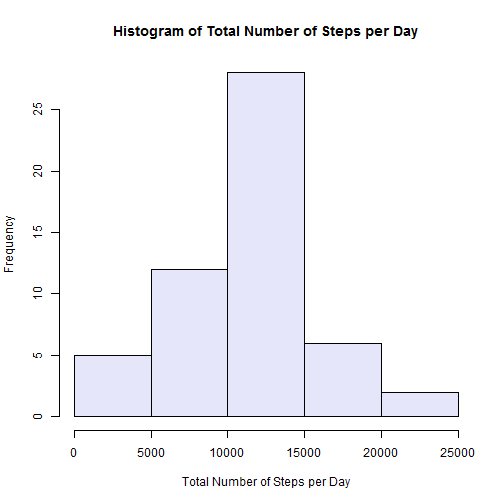
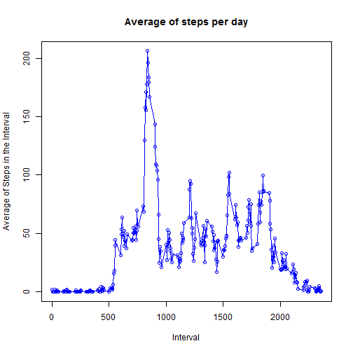
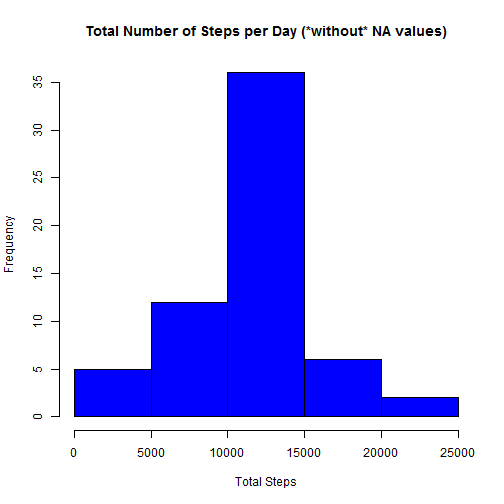
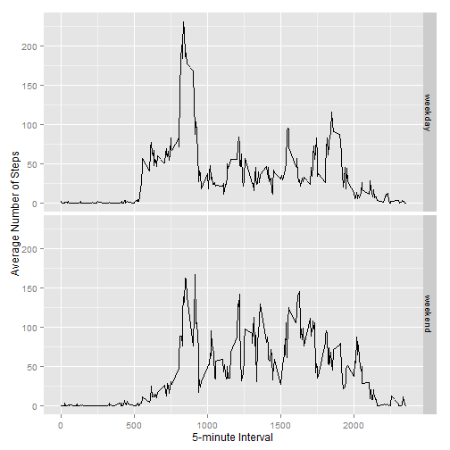

## Peer Assesment Project 1
### Coursera Data Science: Reproducible Research --- June 2015
#### Introduction
This assignment makes use of data from a personal activity monitoring device. This device collects data at 5 minute intervals through out the day. The data consists of two months of data from an anonymous individual collected during the months of October and November, 2012 and include the number of steps taken in 5 minute intervals each day.

#### Data
The data for this assignment can be downloaded from the course web site: Activity monitoring data [52K]

The variables included in this dataset are:

*steps*: Number of steps taking in a 5-minute interval (missing values are coded as NA)  
*date*: The date on which the measurement was taken in YYYY-MM-DD format  
*interval*: Identifier for the 5-minute interval in which measurement was taken  
The dataset is stored in a comma-separated-value (CSV) file and contains a total of 17,568 observations.

1. *Firstly, we load and preprocess the data. My activity.zip file is right at the working directory along with the PA1_template.Rmd and other stuff*


```r
library(ggplot2)
act <- read.csv(unzip("repdata-data-activity.zip"))
```

```
## Warning in unzip("repdata-data-activity.zip"): error 1 in extracting from
## zip file
```

```
## Error in file(file, "rt"): invalid 'description' argument
```

2. *Format dates to the appropiate type*

```r
act$date <- as.Date(act$date , format = "%Y-%m-%d")
```

3. *From the original data, create and name the columns steps, day and interval*

```r
act.day <- aggregate(act$steps, by=list(act$date), sum)
act.interval <- aggregate(act$steps, by=list(act$interval), sum)
names(act.day)[2] <- "steps"
names(act.day)[1] <- "date"
names(act.interval)[2] <- "steps"
names(act.interval)[1] <- "interval"
```

4. *Now, to the orginal data, we'll aggregate and name a column with the mean number of steps per interval*

```r
act.m.interval <- aggregate(act$steps, by=list(act$interval), mean, na.rm=TRUE, na.action=NULL)
names(act.m.interval)[1] <- "interval"
names(act.m.interval)[2] <- "mean.steps"
```

#### First Question: ¿What is mean total number of steps taken per day?
*We'll calculate both MEAN and MEDIAN:*

```r
mean(act.day$steps, na.rm = TRUE)
```

```
## [1] 10766.19
```

```r
median(act.day$steps, na.rm = TRUE )
```

```
## [1] 10765
```
*Note that the summary command shows, also, the number of NA in the set*

```r
summary(act.day$steps)
```

```
##    Min. 1st Qu.  Median    Mean 3rd Qu.    Max.    NA's 
##      41    8841   10760   10770   13290   21190       8
```
* And, the requested histogram:*

```r
hist(act.day$steps, col = "lavender", main = "Histogram of Total Number of Steps per Day",
     xlab = "Total Number of Steps per Day")
```

 

#### Second Question: ¿What is the average daily activity pattern? Specifically:
1. Make a time series plot (i.e. type = "l") of the 5-minute interval (x-axis) and the average number of steps taken, averaged across all days (y-axis)
2. Which 5-minute interval, on average across all the days in the dataset, contains the maximum number of steps?

*Something slightly different (I do like more circles around dots of data than simple lines)*

```r
data <- read.csv("activity.csv")
```

```
## Warning in file(file, "rt"): cannot open file 'activity.csv': No such file
## or directory
```

```
## Error in file(file, "rt"): cannot open the connection
```

```r
stepsInInterval<-aggregate(steps~interval, data, mean)
plot(stepsInInterval$interval, stepsInInterval$steps, type='o', col='blue',main="Average of steps per day", xlab="Interval", ylab="Average of Steps in the Interval")
```

 

*Now we want to find which 5-minute interval,in the dataset, contains the maximum number of steps?*  
(note the answer points exactly to the sudden **peak** in previous plot: the **5-minutes interval number 835**)


```r
act.m.interval[which.max(act.m.interval$mean.steps), 1]
```

```
## [1] 835
```
##### Now: *"The presence of missing days may introduce bias into some calculations or summaries of the data"*

#### Third Question: ¿Are there differences in activity patterns between weekdays and weekends?

*¿How many NA values are in the set?*


```r
table(is.na(data$steps))
```

```
## 
## FALSE  TRUE 
## 15264  2304
```
*In order to correct this situation, let's merge and replace lost/missed/NA values with*
*the MEAN value for the interval, as given by the 'function'* act.m.interval.
*and then create a 'new' set with* NO *NA values*


```r
act.lost <- merge(act, act.m.interval, by = "interval", sort= FALSE)
act.lost$steps[is.na(act.lost$steps)] <- act.lost$mean.steps[is.na(act.lost$steps)]
act.nona <- act.lost[, c(2,3,1)]
```
*Before going any further, compare the new and old set of data*
*Create a new dataset with the total steps per day*


```r
act.day.new <- aggregate(act.nona$steps, by=list(act.nona$date), sum)
names(act.day.new)[1] <-"day"
names(act.day.new)[2] <-"steps"
```

*And now plot the new 'corrected' histogram*


```r
hist(act.day.new$steps, col = "blue", main = "Total Number of Steps per Day (*without* NA values)", xlab = "Total Steps")
```

 

By looking histograms is hard to tell a difference; let's compare using the MEAN & MEDIAN:


```r
mean(act.day.new$steps)
```

```
## [1] 10766.19
```

```r
median(act.day.new$steps)
```

```
## [1] 10766.19
```

*MEAN values with AND without NA data are the same but, the original MEDIAN was slightly smaller than the 'corrected' value*

#### Fourth Question: ¿Are there differences in activity patterns between weekdays and weekends?

First we need to separate our set in 'weekdays' and 'weekend' days.  
And then we add a new column with this new datum: wDay (week or weekend day.)


```r
act.nona$wDay <- ifelse(as.POSIXlt(act.nona$date)$wday %in% c(0,6), 'weekend', 'weekday')
adi <- aggregate(steps ~ interval + wDay, data=act.nona, mean)
```

Now it is possible to use, again, a time series plot with 'interval' in the X-axis and  
the average number of steps per days@interval in the Y-axis and compare the activity    
of weekdays versus weekend days.


```r
ggplot(adi, aes(interval, steps)) + 
    geom_line() + 
    facet_grid(wDay ~ .) +
    xlab("5-minute Interval") + 
    ylab("Average Number of Steps")
```

 
